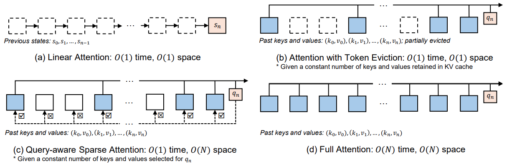
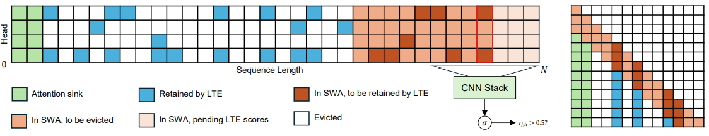

# Alleviating Forgetfulness of Linear Attention by Hybrid Sparse Attention and Contextualized Learnable Token Eviction

<div align="center">

[](https://arxiv.org/abs/2510.20787)

</div>

Welcome to the reference implementation for the paper [Alleviating Forgetfulness of Linear Attention by Hybrid Sparse Attention and Contextualized Learnable Token Eviction](https://arxiv.org/abs/2510.20787)!
Here provides the code for the [hybrid sparse & linear attention](fla/models/hybrid_gated_deltanet), [Learnable Token Eviction layer](fla/layers/lte.py),  SWA+KV sparse attention prefilling & decoding [kernels](fla/ops/lte), and NSA decoding [kernels](fla/ops/nsa), based upon the [Flash Linear Attention](https://github.com/fla-org/flash-linear-attention).

<p align="center">
  
</p>
<div style="margin: 0 auto; font-family: Serif;font-size: 12px;max-width: 400px;line-height: 1.0;text-align:justify">
Hierarchy of token mixers across different time and space complexity per step. More complete and direct access to past tokens entails higher time and space costs. We explore the hybrid of different token mixers across the hierarchy.
</div>

<p align="center">
  
</p>
<div style="margin: 0 auto; font-family: Serif;font-size: 12px;max-width: 400px;line-height: 1.0;text-align:justify">
Left: Illustration of our KV eviction scheme, combining LTE, an attention sink (size s=2), and SWA (w=12), with 4 KV heads. 
A CNN stack is trained end-to-end to predict a per-token, per-head retention score r_{j,h} to decide whether a KV-pair will be evicted when moved out of SWA.
With recent KVs cached by SWA, the CNN can read short-range past and future context. r_j can be computed once the CNN receptive field is fully covered by SWA. 
Right: Resulting per-head A-plus-column sparsity pattern; colored tiles indicate selected tokens at each step.
</div>

## Abstract

Linear-attention models that compress the entire input sequence into a fixed-size recurrent state offer an efficient alternative to Transformers, but their finite memory induces forgetfulness that harms retrieval-intensive tasks. To mitigate the issue, we explore a series of hybrid models that restore direct access to past tokens. We interleave token mixers with intermediate time and space complexity between linear and full attention, including sparse attention with token eviction, and the query-aware native sparse attention. Particularly, we propose a novel learnable token eviction approach. Combined with sliding-window attention, an end-to-end trainable lightweight CNN aggregates information from both past and future adjacent tokens to adaptively retain a limited set of critical KV-pairs per head, maintaining linear attention's constant time and space complexity. Efficient Triton kernels for the sparse attention mechanisms are provided. Empirical evaluations on retrieval-intensive benchmarks support the effectiveness of our approaches.

## Usages

The code is developed upon [Flash Linear Attention](https://github.com/fla-org/flash-linear-attention) and [Flame](https://github.com/fla-org/flame), so please refer to their repositories for general instructions. 
As for installation, please run
```
pip install -r requirements.txt
pip install git+https://github.com/fla-org/flame@f5c618c6 --no-deps
```
Note the required versions of `torch` and `transformers` to avoid any imcompatibility.

We are undergoing our internal administrative process and our pretrained models will be soon released.
To train an 1.4B laLTE model by yourself on 2 GPUs, run the following command:

```
NNODE=1 NGPU=2 LOG_RANK=0 bash train.sh \
--job.config_file configs/fla.toml \
--job.dump_folder exp/gated-deltanet-lte-1.4B-30B --model.config configs/gated_delta_net_lte_1.4B.json \
--model.tokenizer_path fla-hub/transformer-1.3B-100B \
--optimizer.name AdamW --optimizer.lr 3e-4 \
--lr_scheduler.warmup_steps 512 --lr_scheduler.lr_min 0.1 --lr_scheduler.decay_type cosine \
--training.data_parallel_shard_degree 2 --training.data_parallel_replicate_degree 1 \
--training.batch_size 8 --training.seq_len 4096 --training.gradient_accumulation_steps 16 \
--training.steps 30720 --training.max_norm 1.0 --training.skip_nan_inf \
--training.dataset HuggingFaceFW/fineweb-edu --training.dataset_name sample-100BT --training.dataset_split train \
--training.num_workers 32 --training.prefetch_factor 2 --training.seed 42 \
--checkpoint.interval 320 --checkpoint.load_step -1 --metrics.log_freq 4 --profiling.profile_freq 5120
```

Other model configs are available in `configs/` directory. Please refer to [Flame](https://github.com/fla-org/flame) documentation or [code](https://github.com/fla-org/flame/blob/24b29805db77d9b30c8dd6b97fc5315be489f878/flame/config_manager.py) for more details about the command arguments.

As for evaluations, we run lm-eval like 
```
python -m evals.harness --output_path results/gated-deltanet-lte-0.4B-10B/ruler --tasks niah_single_1,niah_single_2,niah_single_3 \
--model_args pretrained=MODEL_PATH,dtype=float32,max_length=16384,trust_remote_code=True,add_bos_token=True \
--metadata '{"max_seq_lengths": [1024, 2048, 4096]}' --batch_size 32 --show_config --trust_remote_code
```
You may need to run `pip install lm-eval[ruler]` beforehand.


## Citation
If you find the paper or code useful, please consider citing:
```
@misc{he_alleviating_2025,
    title = {Alleviating {Forgetfulness} of {Linear} {Attention} by {Hybrid} {Sparse} {Attention} and {Contextualized} {Learnable} {Token} {Eviction}},
    url = {http://arxiv.org/abs/2510.20787},
    doi = {10.48550/arXiv.2510.20787},
    publisher = {arXiv},
    author = {He, Mutian and Garner, Philip N.},
    month = oct,
    year = {2025},
    note = {arXiv:2510.20787 [cs]},
}
```
